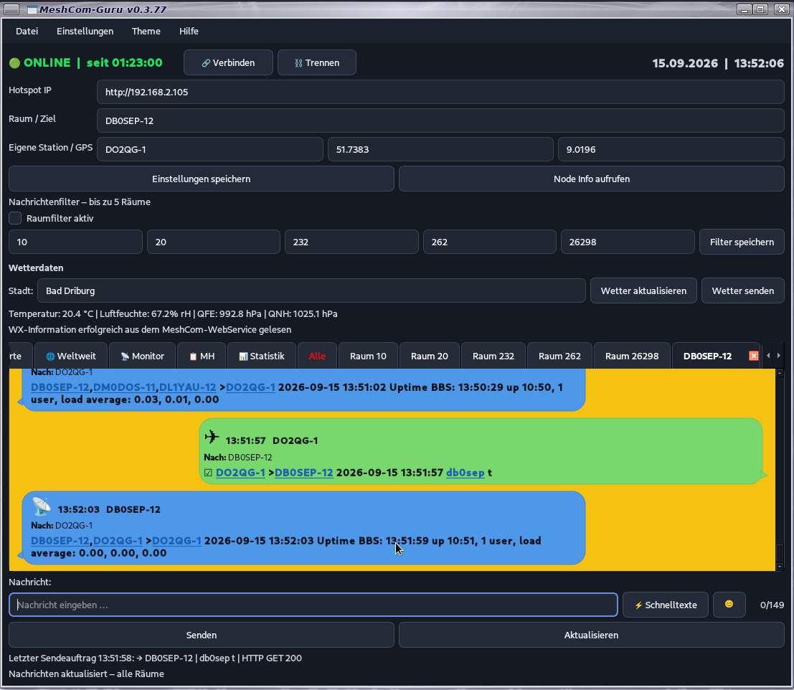

# MeshCom-Guru

**Version 0.3.53** 

MeshCom-Guru ist eine eigenständige Anwendung zur Anzeige von MeshCom-Nachrichten, Node-Informationen und Positionsdaten.



[Github Seite](https://github.com/Angonikro/MeshCom-Guru/)

## Inhalt

- Chat mit empfangenen MeshCom-Nachrichten
- Räume und private Nachrichten
- Node-Informationen
- Kartenanzeige mit Positionsdaten
- Anzeige eigener Positionsdaten
- integriertes Menü **Hilfe**
- integrierte **Anleitung**
- **Info**-Fenster mit Programmversion
- Linux- und Windows-Startdateien
- Desktop-Launcher für Linux

---

# Installation unter Linux

## 1. ZIP-Datei entpacken

Entpacke die ZIP-Datei so, dass der Projektordner genau

`MeshCom`

heißt.

Beispiel:

```text
~/Downloads/MeshCom
```

## 2. Terminal öffnen

Wechsle in den Projektordner:

```bash
cd ~/Downloads/MeshCom
```

## 3. Abhängigkeiten installieren

Führe aus:

```bash
chmod +x run_linux.sh install_desktop_launcher.sh scripts/create_desktop_entry.sh
```

Danach:

```bash
python3 -m pip install -r requirements.txt
```

Falls dein Linux-System die Installation von Python-Paketen außerhalb einer virtuellen Umgebung verhindert, kannst du eine virtuelle Umgebung verwenden:

```bash
python3 -m venv .venv
source .venv/bin/activate
pip install -r requirements.txt
```

## 4. MeshCom-Guru starten

Mit:

```bash
./run_linux.sh
```

Alternativ:

```bash
python3 main.py
```

---

# Desktop-Launcher unter Linux installieren

MeshCom-Guru enthält ein Skript zum Erstellen einer Desktop-Verknüpfung.

Wechsle zuerst in den Projektordner:

```bash
cd ~/Downloads/MeshCom
```

Dann:

```bash
chmod +x install_desktop_launcher.sh
./install_desktop_launcher.sh
```

Falls das Skript mit fehlenden Rechten abbricht:

```bash
sudo ./install_desktop_launcher.sh
```

Danach sollte ein Starter für **MeshCom-Guru** im Desktop-/Anwendungsmenü vorhanden sein.

Zusätzlich kann der Desktop-Eintrag über das enthaltene Skript erstellt werden:

```bash
chmod +x scripts/create_desktop_entry.sh
./scripts/create_desktop_entry.sh
```

Der Launcher startet MeshCom-Guru über das Projekt und verwendet das mitgelieferte Icon.

---

# Installation unter Windows

## 1. ZIP-Datei entpacken

Entpacke die ZIP-Datei in einen geeigneten Ordner, zum Beispiel:

```text
C:\MeshCom
```

Der eigentliche Projektordner muss **MeshCom** heißen.

## 2. Python installieren

Für Windows wird eine aktuelle Python-3-Version benötigt.

Bei der Python-Installation sollte **Add Python to PATH** aktiviert werden.

## 3. Abhängigkeiten installieren

Öffne die Eingabeaufforderung oder PowerShell und wechsle in den Projektordner:

```bat
cd C:\MeshCom
```

Danach:

```bat
python -m pip install -r requirements.txt
```

## 4. MeshCom-Guru starten

Die mitgelieferte Windows-Startdatei kann verwendet werden:

```text
run_windows.bat
```

Alternativ:

```bat
python main.py
```

---

# Hilfe und Info

In der Menüleiste befindet sich der Punkt:

**Hilfe**

Dort stehen zwei Funktionen zur Verfügung:

### Anleitung

Öffnet eine integrierte Kurzanleitung direkt in MeshCom-Guru.

### Info

Öffnet ein kleines Informationsfenster mit:

**MeshCom-Guru**  
**Version 0.3.52**

**By Goldisoft 2026**

---

# Chat

Im Chatbereich werden empfangene MeshCom-Nachrichten angezeigt.

Die vorhandenen Tabs ermöglichen die getrennte Anzeige von:

- allen Nachrichten
- Räumen
- privaten Nachrichten

Nachrichten können über das Eingabefeld erstellt und mit **Senden** übertragen werden.

---

# Node-Informationen

Empfangene Node-Informationen können angezeigt werden.

Je nach übertragenen Daten können unter anderem folgende Informationen vorhanden sein:

- Rufzeichen
- Firmware
- Hardware-ID
- RSSI
- SNR
- Batterie
- Temperatur
- weitere Telemetriedaten
- Positionsdaten

---

# Karte und Koordinaten

Wenn ein Node Positionsdaten überträgt, können diese auf der Karte als Marker dargestellt werden.

Dabei werden insbesondere folgende Daten verwendet:

- Breitengrad
- Längengrad
- Höhe
- Rufzeichen

Die Positionsdaten stammen aus den empfangenen MeshCom-Daten.

---

# Eigene Position

Falls die Funktion verwendet wird, können die eigenen Koordinaten über die dafür vorgesehenen Eingabefelder angegeben werden.

Beispiel:

```text
Breitengrad: 51.93
Längengrad: 8.88
```

---

# Eigenständiger Betrieb

MeshCom-Guru ist als eigenständige Anwendung aufgebaut.

Die Anwendung benötigt **keine Zusammenarbeit mit MeshDash**.

---

# Projektdateien

Wichtige Dateien und Verzeichnisse:

```text
MeshCom/
├── core/
├── data/
├── docs/
├── icons/
├── scripts/
├── ui/
├── main.py
├── requirements.txt
├── run_linux.sh
├── run_windows.bat
├── install_desktop_launcher.sh
├── README.md
├── CHANGELOG.md
└── VERSION
```

---

# Start unter Linux – Kurzfassung

```bash
cd ~/Downloads/MeshCom
chmod +x run_linux.sh
./run_linux.sh
```

Desktop-Launcher:

```bash
cd ~/Downloads/MeshCom
chmod +x install_desktop_launcher.sh
./install_desktop_launcher.sh
```

---

# Start unter Windows – Kurzfassung

Im Ordner `MeshCom` einfach

```text
run_windows.bat
```

starten.

---

**MeshCom-Guru v0.3.53**  
**By Goldisoft 2026**


## GitHub

Dieses Paket ist als vollständiger Projektstand für GitHub vorbereitet.
Der ZIP-Inhalt beginnt mit dem Ordner `MeshCom/`.

Die Projektdateien, Dokumentation, Startdateien, Desktop-Launcher,
Anleitung und das Programm-Icon sind im Projekt enthalten.

Die separate PDF-Anleitung liegt dem GitHub-Paket ebenfalls als
`docs/MeshCom-Guru_Anleitung_v0.3.53.pdf` bei.

73 de DO2QG Andreas


## Hilfe und Info

In der Menüleiste gibt es **Hilfe → Anleitung** mit einer integrierten Kurzanleitung sowie **Hilfe → Info** mit Programmname, Version und Urheberhinweis.
