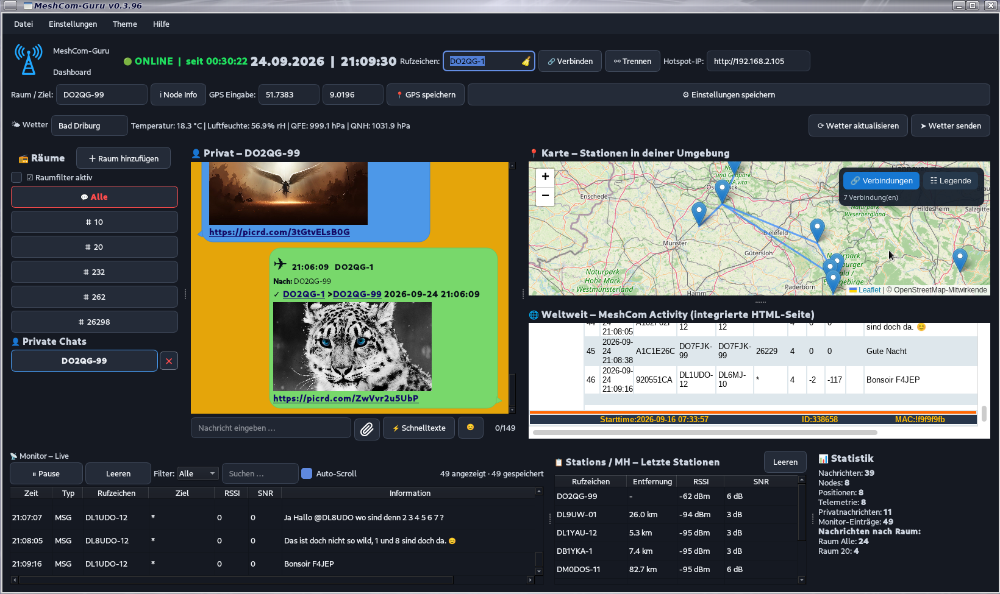
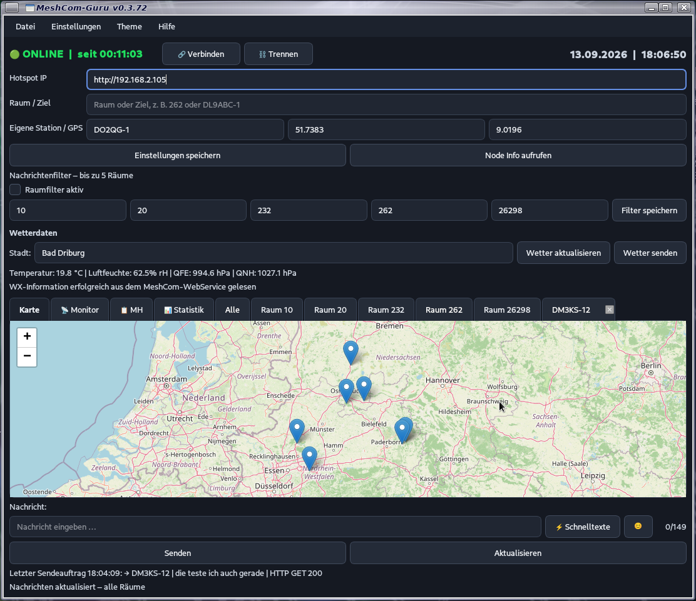

# MeshCom-Guru

MeshCom-Guru ist eine eigenständige Anwendung zur Anzeige von MeshCom-Nachrichten, Node-Informationen und Positionsdaten.






[Github Seite](https://github.com/Angonikro/MeshCom-Guru/)

## Inhalt

- Chat mit empfangenen MeshCom-Nachrichten
- Räume und private Nachrichten
- Node-Informationen
- Kartenanzeige mit Positionsdaten
- Anzeige eigener Positionsdaten
- integriertes Menü **Hilfe**
- integrierte **Anleitung**
- **Info**-Fenster mit Programmversion
- Linux- und Windows-Startdateien
- Desktop-Launcher für Linux
- Nachrichtenfeld mit einer maximalen Länge von **149 Zeichen**
- Live-Zeichenzähler im Nachrichtenfeld (`0/149` bis `149/149`)
- **Emoji-Auswahl** direkt am Nachrichtenfeld mit automatischem Schließen nach der Auswahl
- **Einheitliche Chat-Bubbles in den normalen Raum-Tabs:** gleiche Anordnung und Farbgebung wie im funktionierenden Privat-Chat.
- **Eigene Nachrichten in Räumen:** rechts/grün; empfangene Nachrichten links/blau.
- **Tab „Alle“:** bleibt von der neuen Raum-Bubble-Darstellung ausdrücklich ausgenommen.

## Version 0.3.90

### Neu in v0.3.90 – Backup/Restore und Update-Prüfung

- 💾 **Backup:** Die persönlichen MeshCom-Guru-Daten aus `~/.MeshCom` können als ZIP-Datei gesichert werden.
- ♻️ **Restore:** Eine Sicherung kann wiederhergestellt werden. Die wiederhergestellten Daten werden direkt in die laufende Anwendung übernommen und bleiben auch nach dem Neustart erhalten.
- 🔒 **Sicherer Restore:** Beim Neustart nach einem Restore wird verhindert, dass ein vorheriger leerer In-Memory-Zustand die restaurierten Einstellungen überschreibt.
- 🔄 **Nach Update suchen:** MeshCom-Guru kann die aktuelle GitHub-Release-Version prüfen und bei Bedarf auf die Release-Seite hinweisen. Es erfolgt keine automatische Installation.
- 🌐 **Übersetzungen:** Backup, Restore und Update-Prüfung sind in Deutsch, English, Italiano, Nederlands und Français verfügbar.
- 🧩 **Stabilität:** Die bestehende Empfangs-, Chat-, Monitor-, Dashboard-, Karten- und Weltweit-Verarbeitung bleibt unverändert.

## Version 0.3.89

### Neu in v0.3.89 – Via-/Privatnachrichten sauber unterscheiden

- 📡 **Via-Nachrichten:** Die vollständige Zielangabe hinter `>` wird jetzt bei der Privatnachrichten-Erkennung berücksichtigt.
- 💬 **Privat-Chat:** Ein Header wie `OE5HWN-12,DO2GG-1 > OE5XLM-12,232` wird nicht mehr fälschlich als reine Privatnachricht erkannt, weil nach dem Ziel-Rufzeichen noch die Raumangabe `,232` folgt.
- 🧭 **Zielauswertung:** Die App prüft den Zielteil rechts vom `>` vollständig, bevor eine Nachricht einem Privat-Chat zugeordnet wird.
- 🧩 **Stabilität:** Die bestehende Empfangs-, Monitor-, Raum-, Dashboard- und Chat-Verarbeitung bleibt ansonsten unverändert.

## Version 0.3.88

## Neu in v0.3.88 – Rufzeichen-Menü und QRZ-Verknüpfung

- 📡 **Rufzeichen-Menü:** Rufzeichen können im Dashboard und in der klassischen Ansicht über das neue Kontextmenü direkt weiterverarbeitet werden.
- 💬 **Privat Chat:** Über das Rufzeichen-Menü kann direkt ein privater Chat mit dem ausgewählten Rufzeichen geöffnet werden.
- 💬 **@Rufzeichen:** Über den Menüpunkt `@Rufzeichen` wird das Rufzeichen als Erwähnung für das Nachrichtenfeld vorbereitet.
- 🌐 **QRZ.com:** Über das Rufzeichen-Menü lässt sich die passende QRZ.com-Seite direkt im normalen Systembrowser öffnen.
- 🔎 **QRZ-Rufzeichen:** Für QRZ.com wird automatisch nur das reine Rufzeichen verwendet. Beispiel: `DO1ABC-12` wird bei QRZ.com zu `DO1ABC`.
- 🧩 **Stabilität:** Die neue Rufzeichenfunktion wurde ohne Eingriff in die bestehende Empfangs-, Monitor- und Chat-Verarbeitung umgesetzt.


## Neu in v0.3.87 – Dashboard-Feinschliff und Monitor verbessert

- 📊 **Statistik:** Das Statistikfeld im Dashboard ist jetzt auch bei vielen Einträgen scrollbar, sodass alle Werte und Raumstatistiken erreichbar bleiben.
- 📡 **Monitor:** Die Schaltflächen **Pause** und **Leeren** wurden etwas verbreitert und besser an die übrigen Bedienelemente angepasst.
- 🔎 **Monitor-Spalten:** **Rufzeichen** und **Ziel** haben jetzt dieselbe Breite, damit auch längere Rufzeichen und Ziele vollständig lesbar bleiben.
- 🌐 **Übersetzungen:** Der Monitor-Filter **„Alle“** verwendet jetzt beim Sprachwechsel die passende Übersetzung in Deutsch, English, Italiano, Nederlands und Français.
- 📻 **Räume:** Die Überschrift **„Räume“** bleibt vollständig sichtbar; der Button **„Raum hinzufügen“** wurde dafür fein angepasst, ohne die übrige Raumliste zu verändern.
- ✨ **Kleine optische Verbesserungen:** Mehrere Monitor- und Dashboard-Bedienelemente wurden für eine bessere Lesbarkeit und ein einheitlicheres Erscheinungsbild fein abgestimmt.


## Neu in v0.3.86 – MH-Liste auf 250 Stationen erweitert

- 📡 **MH-Liste:** Es werden maximal **250 zuletzt gehörte Stationen** gespeichert und angezeigt.
- 🧹 Beim Empfang einer 251. Station wird automatisch der **älteste MH-Eintrag entfernt**.
- 🖥️ **Klassische Ansicht:** Die MH-Liste kann bis zu 250 Stationen enthalten.
- 📊 **Dashboard:** Die Dashboard-MH-Liste übernimmt ebenfalls bis zu 250 Stationen.
- ⚡ Dadurch bleibt die MH-Liste auch bei langer Laufzeit überschaubar und speicherschonend.
- 🔄 Die Einträge werden nach dem tatsächlichen letzten Empfangszeitpunkt sortiert.
- 📡 **Dashboard-Monitor:** Pause, Leeren, Filter, Suche und Auto-Scroll stehen jetzt direkt über dem Monitor zur Verfügung – wie in der klassischen Ansicht.
- 🧹 **MH-Leeren:** Die Dashboard-MH-Liste kann direkt über einen **Leeren**-Button gelöscht werden.
- 📊 **Statistik:** Die Dashboard-Statistik wird übersichtlich untereinander angezeigt.
- 📡 **Telemetrie:** Die Statistik zählt zusätzlich die seit Programmstart empfangenen Telemetrie-Datensätze.
- 🧩 **Layout:** Die vorhandenen Dashboard-Fenster behalten ihre bisherigen Größen und Positionen.


## Neu in v0.3.85 – Dashboard-Layout und Weltweit stabilisiert

- 🖥️ **Dashboard-Layout angepasst:** Die Aufteilung entspricht jetzt dem festgelegten Referenzlayout.
- 💬 **Chatbereich:** Der Chat wurde gegenüber der vorherigen Aufteilung verbreitert.
- 🗺️ **Karte und 🌐 Weltweit:** Beide Bereiche wurden entsprechend etwas kompakter gehalten, damit der zusätzliche Platz dem Chat zur Verfügung steht.
- 📻 **Räume:** **Räume** und **+ Raum hinzufügen** stehen direkt nebeneinander. Die Größe und Anordnung der Raum-Buttons bleiben unverändert.
- 🌐 **Weltweit:** Die bestehende WebKitGTK-Integration bleibt erhalten.
- 🖱️ **Mausrad:** Die funktionierende GTK-Capture-Mausradbehandlung für Weltweit bleibt erhalten.

## Neu in v0.3.84 – Nachrichtenanzeige und Monitor stabilisiert

- 💬 **„Alle“ – gleiche Nachricht mehrfach möglich:** Zwei Nachrichten vom gleichen Rufzeichen mit identischem Text werden anhand des Zeitstempels unterschieden. Ein zweites „test“ wird dadurch nicht mehr als Duplikat verworfen.
- 📡 **Monitor – eigene Sendungen:** Eine erfolgreich an den MeshCom-WebService übertragene eigene Nachricht wird sofort im Monitor gespeichert und angezeigt – unabhängig davon, ob später ein UDP-/MH-Echo über die Antenne zurückkommt.
- 📡 **Eigenes Echo:** Kommt das eigene Echo später zurück, wird es mit der vorhandenen lokalen Sendung zusammengeführt und nicht doppelt angezeigt.
- 🔎 **Exakte Zuordnung:** Beim Zusammenführen wird der exakte Nachrichtentext verwendet, damit unterschiedliche Nachrichten nicht versehentlich zusammengeführt werden.
- ⏸️ **Monitor-Pause:** Eigene Sendungen werden auch während einer Monitor-Pause intern gespeichert.
- 🧩 **Lange Laufzeit:** Wiederverwendete MsgIds können neue Nachrichten nicht mehr aus dem Chat verdrängen.
- Die bestehende MH-/UDP-Empfangsverarbeitung bleibt unverändert.

## Neu in v0.3.83 – Raum / Ziel bei „Alle“

- 💬 **Dashboard: „Alle“ setzt das Sendeziel zurück:** Beim Wechsel aus einem Raum auf **Alle** wird das Feld **Raum / Ziel** jetzt sofort geleert. Der zuvor ausgewählte Raum bleibt dadurch nicht mehr als letztes Sendeziel stehen.
- Klassische Ansicht und Dashboard verwenden beim Wechsel auf **Alle** dasselbe Verhalten.


## Neu in v0.3.82 – Einstellungen speichern

- **⚙️ Einstellungen speichern:** Beim Speichern der Einstellungen im **Dashboard** und in der **klassischen Ansicht** wird die bestehende MeshCom-Verbindung nicht mehr unnötig getrennt.
- Die Verbindung bleibt online, anstatt durch das Speichern einen Disconnect mit anschließendem automatischen Reconnect auszulösen.
- Die bereits funktionierenden Link-, Rufzeichen-, Dashboard- und Chat-Funktionen aus **v0.3.81** bleiben erhalten.

## Neu in v0.3.81 – Links und Rufzeichen in Raum-Chats

- **🌐 Weltweit:** Externe Internetlinks in der eingebetteten ÖVSV-Seite öffnen im normalen Systembrowser; die Weltweit-Seite bleibt eingebettet.
- **🔗 Raum-Chats – Internetlinks:** Internetlinks in den Nachrichten der Räume sind wieder anklickbar und öffnen im normalen Systembrowser.
- **📡 Raum-Chats – Rufzeichen:** Anklickbare Rufzeichen in den Räumen öffnen direkt den passenden privaten Chat.
- **✕ Privatchats:** Private Chats im Dashboard besitzen einen sichtbaren X-Button zum Schließen.
- **🔢 Zeichenzähler:** Das Dashboard-Nachrichtenfeld zeigt live `0/149` bis `149/149`.

## Neu in v0.3.80 – WebKitGTK für Weltweit

- **🌐 Weltweit direkt im Fenster:** Die echte ÖVSV-MeshCom-Webseite wird im Weltweit-Bereich über **WebKitGTK** eingebettet.
- **Automatische Plattform-Erkennung:** MeshCom-Guru erkennt selbst, ob es unter **Linux** oder **Windows** läuft, und verwendet für **Weltweit** automatisch die passende Web-Technik: **WebKitGTK unter Linux/Raspberry Pi** und **QtWebEngine unter Windows**. Die OSM-Karte bleibt auf beiden Plattformen unverändert über QtWebEngine.
- **ACTIVITY automatisch:** Beim Laden wird weiterhin automatisch die **ACTIVITY**-Ansicht ausgewählt.
- **RAM-schonender Weltweit-Bereich:** Weltweit verwendet keinen eigenen QtWebEngine-/Chromium-Renderer mehr.
- **OSM-Karte bleibt erhalten:** Die vorhandene OSM-/Leaflet-Karte läuft weiterhin über die bisherige QtWebEngine-Implementierung.
- **Startgröße korrigiert:** Die Weltweit-Webseite wird direkt mit der verfügbaren Höhe angezeigt; der Splitter muss nicht mehr zuerst bewegt werden.
- Für WebKitGTK ist unter Debian/Raspberry Pi einmal `./install_webkitgtk.sh` auszuführen.
- **Übersetzungen aktualisiert:** Dashboard-, Monitor-, MH- und Wettertexte wurden in Deutsch, English, Italiano, Nederlands und Français ergänzt bzw. korrigiert.
- **Temperaturanzeige:** Die Bezeichnung wird ohne den fehlerhaften zusätzlichen Buchstaben dargestellt. Beim Sprachwechsel werden die Wetterwerte aus den Rohdaten neu aufgebaut.

## Automatische Web-Engine-Auswahl

MeshCom-Guru erkennt die verwendete Plattform automatisch. Für den Tab **🌐 Weltweit** wird dadurch ohne manuelle Auswahl die passende Web-Engine verwendet:

- **Linux / Raspberry Pi:** **WebKitGTK** – dadurch wird für Weltweit kein eigener QtWebEngine-/Chromium-Renderer verwendet.
- **Windows:** **QtWebEngine** – die bisher bewährte Windows-Integration bleibt erhalten.
- **Karte / OSM:** Die Kartenansicht verwendet weiterhin **QtWebEngine**.

Der Benutzer muss die Plattform nicht selbst einstellen.

---

## Neu in v0.3.79 – Emoji-Fix und Dashboard

- **Emoji-Popup:** Das Fenster öffnet sich direkt über dem gedrückten Smiley-Symbol.

### Emoji-Fix in v0.3.79
- Der Emoji-Picker merkt sich jetzt das Nachrichtenfeld, das beim Öffnen aktiv war.
- Dadurch werden keine alten Smileys aus dem anderen Nachrichtenfeld mehr eingefügt.
- Nach der Auswahl bleibt der Cursor im richtigen Nachrichtenfeld.

## Neu in v0.3.78 – Neues Dashboard

Das **neue Dashboard** steht in v0.3.78 ganz im Mittelpunkt. Unter **Einstellungen → Darstellung** kann jederzeit zwischen **Dashboard** und **Klassisch** gewechselt werden. Beide Ansichten verwenden dieselben MeshCom-Daten und Funktionen.

### Dashboard in v0.3.78
- **Rufzeichen direkt im Dashboard:** Das eigene Rufzeichen kann jetzt oben in der ersten Reihe direkt eingegeben und gespeichert werden.
- **Kompakte Kopfzeilen:** Raum/Ziel, Node Info, GPS und „Einstellungen speichern“ sind übersichtlich in der zweiten Reihe angeordnet.
- **GPS-Schaltfläche nur einmal:** „GPS speichern“ erscheint im Dashboard nur noch an einer Stelle.
- **GPS-Synchronisation:** Beim Wechsel von **Klassisch** zu **Dashboard** werden die aktuell eingegebenen GPS-Daten der klassischen Ansicht sofort ins Dashboard übernommen.

- **Neues Dashboard-Design:** Übersichtliche Gesamtansicht mit Räumen, Alle, Privaten Chats, Karte, Weltweit, Monitor, Stations / MH und Statistik.
- **Alle oben:** Die Ansicht **Alle** steht im Dashboard direkt unter dem Raumfilter.
- **Stabile Chat-Bubbles:** Die Nachrichtenblasen bleiben beim Aktualisieren stabil und springen nicht unnötig.
- **Ungelesene Chats:** Neue Nachrichten markieren Räume, **Alle** und Private Chats sichtbar.
- **Private Chats:** Die Liste besitzt einen eigenen Scrollbereich, damit viele private Chats Karte, Weltweit und die unteren Bereiche nicht verdrängen.
- **Karte:** Stations-/Positionsmarker bleiben auch im Dashboard erhalten.
- **🌐 Weltweit:** Die MeshCom-Activity-Seite ist direkt im Dashboard eingebettet. Die Webseite übernimmt ihre eigene Aktualisierung; es gibt keinen zusätzlichen 15-Sekunden-Refresh.
- **Weltweit-Selbstheilung:** Bei einem Renderer-Absturz oder einem länger anhaltenden Hänger wird die eingebettete Weltweit-Webseite automatisch wiederhergestellt.
- **Klassisch-Fix:** Beim Wechsel zwischen Dashboard und Klassisch bleibt die OSM-Karte als QtWebEngine-Ansicht erhalten; Weltweit wird über WebKitGTK eingebettet.
- **Monitor:** Lange Informationen und Nachrichten werden vollständig dargestellt und bei Bedarf umgebrochen; die Informationsspalte bleibt lesbar.
- **Auto-Reconnect:** Nach einem unbeabsichtigten Verbindungsverlust wird automatisch erneut verbunden; die bisherige Onlinezeit läuft beim Reconnect weiter. Ein manuelles Trennen setzt die Onlinezeit bewusst zurück.
- **Einstellungen speichern ohne Disconnect:** Das Speichern persönlicher Einstellungen trennt die bestehende MeshCom-Verbindung nicht mehr. Die Verbindung bleibt beim Speichern online.
- **Wetter und GPS:** Wetterdaten, Wetter-Aktualisierung, Wetter-Senden und **GPS Eingabe** wurden in einer kompakten Dashboard-Zeile zusammengeführt.
- **Mehrsprachigkeit:** Die neuen Dashboard-Bezeichnungen und Funktionen sind in Deutsch, English, Italiano, Nederlands und Français übersetzt.

### Rufzeichenfarbe – Änderung in v0.3.72

- Rufzeichen in den blauen Nachrichtenfeldern der normalen Räume und Privat-Chats werden dunkler dargestellt.
- Der Tab „Alle“ bleibt von dieser Änderung ausgenommen.

### MH-Liste – Korrektur in v0.3.71

- Die MH-Liste übernimmt nur noch Stationen aus tatsächlich über LoRa empfangenen EXTUDP-Paketen (`src_type=lora` bzw. `node`).
- UDP-/Gateway-Verkehr wird nicht mehr fälschlich als „gehörte“ Station in MH eingetragen.
- Bei Relay-Pfaden wird ausschließlich das erste Rufzeichen als ursprünglicher Absender verwendet; weitere Rufzeichen sind Relay-Hops.


### Neu in v0.3.70

- Sichtbare Verbindungsanzeige oben im Fenster: **🟢 ONLINE** bzw. **🔴 OFFLINE**.
- Anzeige, wie lange die aktuelle Verbindung bereits besteht (**Online seit HH:MM:SS**).
- Datum und Uhrzeit in derselben gut lesbaren Größe wie der Online-Status.
- Neuer fester Tab **📊 Statistik** ohne Schließen-X.
- Statistikübersicht für Nachrichten und Räume.


- Raum-Chats, Privat-Chats und Tab „Alle“
- Bewusst geschlossene Privat-Tabs bleiben geschlossen, bis tatsächlich eine neue private Nachricht eintrifft.
- Einheitliche Chat-Bubbles in normalen Raum-Tabs
- Privat-Sendestatus: **⏳** bis zum echten Empfänger-ACK, danach **✓✓**
- **⚡ Schnelltexte** mit Verwaltung und dauerhaftem Speichern
- **😊 Emoji-Picker** mit 149-Zeichen-Limit
- **📡 Monitor** für UDP 1799 mit ALLE / MSG / POS / TEL / ACK, Suche, Pause und Auto-Scroll
- **📋 MH – Most Recently Heard** mit Rufzeichen, Entfernung, RSSI, SNR, Batterie und letztem Empfang
- OSM-/Leaflet-Karte und Positionsdaten
- Node Info
- Wetterdaten / WX
- Sound-Einstellungen und Hell-/Dunkel-Theme
- Raumfilter für bis zu fünf Räume
- persönliche Einstellungen unter `~/.MeshCom/settings.ini`
- **Deutsch / English / Italiano / Nederlands / Français:** umschaltbare Benutzeroberfläche mit gespeicherter Spracheinstellung
- **Chat-Farben:** gemeinsamer Chat-Hintergrund für alle Chat-Ansichten; separate Schriftfarbe für „Alle“
- Standard für Chat-Farben: **schwarzer Hintergrund / weiße Schrift**
- Übersetztes Qt-Kontextmenü für Eingabefelder (Kopieren, Einfügen, Ausschneiden, Löschen usw.)
- Stabileres Beenden mit sauberem UDP-Shutdown
- Chat-Bubbles werden bei einer oder wenigen Nachrichten am unteren Rand des Chatbereichs ausgerichtet; bei längeren Chats bleibt normales Scrollen erhalten
- Beim manuellen Hochscrollen wird die gewählte Position nicht durch neue Nachrichten überschrieben
- Sendererkennung in Raum- und Privat-Chats berücksichtigt den ursprünglichen Absender auch bei weitergeleiteten Nachrichten

---


# Sprache / Language

Unter **Einstellungen → Sprache / Language …** kann zwischen **Deutsch, English, Italiano, Nederlands und Français** gewechselt werden. Die Auswahl wird in `~/.MeshCom/settings.ini` gespeichert und beim nächsten Start wieder verwendet.

Die Benutzeroberfläche wird übersetzt; empfangene Nachrichten, Rufzeichen, Raum- und Zielnummern sowie persönliche Inhalte bleiben unverändert. Die integrierte **Hilfe → Anleitung** folgt der gewählten Sprache.

# Chat-Farben

Unter **Einstellungen → Chat-Farben …** können die Chat-Farben angepasst werden. Die Hintergrundfarbe gilt gemeinsam für alle Raum- und Chat-Ansichten. Die Schriftfarbe wird nur für den Tab **Alle** verwendet; die normalen Chat-Bubbles behalten ihre bestehende Farb- und Textdarstellung. Zusätzlich kann die Farbe für **anklickbare Rufzeichen und Internetlinks** unabhängig ausgewählt werden.

Die gewählte Linkfarbe wird gespeichert und in den Chat-Bubbles sowie beim HTML-Chat-Export verwendet. Mit **Standard wiederherstellen** werden die Chat-Farben einschließlich der Linkfarbe auf die Standardwerte zurückgesetzt; die Standard-Linkfarbe ist `#062f6f`.

# Kontextmenü in Eingabefeldern

Ein Rechtsklick in ein Eingabefeld öffnet das Qt-Kontextmenü. Die Standardbefehle wie Rückgängig, Wiederholen, Ausschneiden, Kopieren, Einfügen, Löschen und Alles auswählen werden entsprechend der gewählten Sprache angezeigt.

# Wetterdaten – BME280/BMP280

Unter **Einstellungen → Wetterdaten** kann die Wetteranzeige aktiviert werden. MeshCom-Guru liest die WX-Information direkt aus dem MeshCom-WebService des verbundenen Nodes. Unterstützt werden die dort angezeigten Werte **Temperatur, Luftfeuchte, QFE und QNH**.

Wenn am MeshCom-Node ein **BME280 oder BMP280 Wettermodul** erkannt wird, können die Wetterinformationen genutzt werden. Der eingegebene **Stadtname** wird zusammen mit den aktuellen Wetterwerten über **Wetter senden** ohne Raumangabe übertragen.

Ist die Wetterfunktion aktiviert, wird die WX-Information nach jedem Programmstart automatisch neu geladen. Die Funktion ist weiterhin als **Testfunktion** gedacht.

# OSM-Karte

Die OSM-/Leaflet-Kartenansicht bietet eine vergrößerte Kartenfläche.

# Persönliche Einstellungen

Die persönliche Konfiguration wird benutzerbezogen unter folgendem Pfad gespeichert:

```text
~/.MeshCom/settings.ini
```

Die Programmdateien selbst bleiben unter `/usr/share/MeshCom`. Beim ersten Start werden nur neutrale Standardwerte angelegt; persönliche Rufzeichen, Hotspot-IP und Räume werden nicht fest in den Programmdateien vorgegeben.

# Debian-Paket

Das Debian-Paket installiert MeshCom-Guru direkt unter:

```text
/usr/share/MeshCom
```

Es wird **keine eigene virtuelle Python-Umgebung** angelegt und während der Paketinstallation werden keine Python-Pakete per `pip` installiert. Das Paket bringt einen Menüeintrag und das Programm-Icon mit.

# Nachrichtenlänge

MeshCom-Nachrichten dürfen maximal **149 Zeichen** enthalten. Das Nachrichtenfeld begrenzt die Eingabe automatisch auf 149 Zeichen. Rechts im Eingabefeld zeigt ein Live-Zähler jederzeit die aktuelle Länge an, zum Beispiel `0/149`, `24/149`, `57/149` oder `149/149`.

Damit ist sofort sichtbar, wie viele Zeichen noch zur Verfügung stehen.

## Internetlinks im Chat

Internetlinks in empfangenen Nachrichten werden automatisch als anklickbare Links dargestellt. Ein Klick auf einen Link mit `http://` oder `https://` öffnet die Adresse im Standard-Webbrowser des Systems.

## Chat-Export

Über **Datei → Chat exportieren …** kann der aktuell ausgewählte Chat als **HTML, TXT oder CSV** gespeichert werden. Der HTML-Export enthält anklickbare Rufzeichen und Internetlinks und verwendet die aktuell eingestellte Linkfarbe. Der Export greift auf die vorhandenen Chatdaten zu und verändert die laufende Chat-Darstellung nicht.

---

# Installation unter Linux

## 1. ZIP-Datei entpacken

Entpacke die ZIP-Datei so, dass der Projektordner genau

`MeshCom`

heißt.

Beispiel:

```text
~/Downloads/MeshCom
```

## 2. Terminal öffnen

Wechsle in den Projektordner:

```bash
cd ~/Downloads/MeshCom
```

## 3. WebKitGTK für „Weltweit“ installieren

Unter **Linux / Raspberry Pi** benötigt der Tab **🌐 Weltweit** WebKitGTK.

Führe im Projektordner einmal aus:

```bash
chmod +x install_webkitgtk.sh
./install_webkitgtk.sh
```

Das Skript installiert die benötigten WebKitGTK-Systempakete. Dieser Schritt ist unter Linux für die Weltweit-Ansicht erforderlich.

## 4. Abhängigkeiten installieren

Führe aus:

```bash
chmod +x run_linux.sh install_desktop_launcher.sh scripts/create_desktop_entry.sh
```

Danach:

```bash
python3 -m pip install -r requirements.txt
```

Falls dein Linux-System die Installation von Python-Paketen außerhalb einer virtuellen Umgebung verhindert, kannst du eine virtuelle Umgebung verwenden:

```bash
python3 -m venv .venv
source .venv/bin/activate
pip install -r requirements.txt
```

## 5. MeshCom-Guru starten

Mit:

```bash
./run_linux.sh
```

Alternativ:

```bash
python3 main.py
```

---

# Desktop-Launcher unter Linux installieren

MeshCom-Guru enthält ein Skript zum Erstellen einer Desktop-Verknüpfung.

Wechsle zuerst in den Projektordner:

```bash
cd ~/Downloads/MeshCom
```

Dann:

```bash
chmod +x install_desktop_launcher.sh
./install_desktop_launcher.sh
```

Falls das Skript mit fehlenden Rechten abbricht:

```bash
sudo ./install_desktop_launcher.sh
```

Danach sollte ein Starter für **MeshCom-Guru** im Desktop-/Anwendungsmenü vorhanden sein.

Zusätzlich kann der Desktop-Eintrag über das enthaltene Skript erstellt werden:

```bash
chmod +x scripts/create_desktop_entry.sh
./scripts/create_desktop_entry.sh
```

Der Launcher startet MeshCom-Guru über das Projekt und verwendet das mitgelieferte Icon.

---

# Installation unter Windows

## 1. ZIP-Datei entpacken

Entpacke die ZIP-Datei in einen geeigneten Ordner, zum Beispiel:

```text
C:\MeshCom
```

Der eigentliche Projektordner muss **MeshCom** heißen.

## 2. Python installieren

Für Windows wird Python **3.10 bis 3.14** benötigt. Die aktuelle PySide6-Version 6.11.2 unterstützt diese Python-Versionen.

Bei der Python-Installation sollte **Add Python to PATH** aktiviert werden.

## 3. Abhängigkeiten installieren

Öffne die Eingabeaufforderung oder PowerShell und wechsle in den Projektordner:

```bat
cd C:\MeshCom
```

Danach:

```bat
python -m pip install -r requirements.txt
```

Die Kartenfunktion benötigt Qt WebEngine. Dieses wird bei der Installation automatisch über `PySide6-Addons[webengine]` bereitgestellt.

**Hinweis:** `PySide6-WebEngine` wird nicht mehr als eigenes Paket verwendet.

## 4. MeshCom-Guru starten

Die mitgelieferte Windows-Startdatei kann verwendet werden:

```text
run_windows.bat
```

Alternativ:

```bat
python main.py
```

Die mitgelieferte `run_windows.bat` prüft die Python-Version, installiert die benötigten Pakete und startet anschließend MeshCom-Guru.

---

# Hilfe und Info

In der Menüleiste befindet sich der Punkt:

**Hilfe**

Dort stehen zwei Funktionen zur Verfügung:

### Weltweit

Der Tab **🌐 Weltweit** befindet sich direkt neben **Karte** und öffnet die öffentliche MeshCom-Aktivitätsseite des ÖVSV. Beim Laden wird automatisch **ACTIVITY** ausgewählt. Die eingebettete Webseite übernimmt ihre eigene Aktualisierung; MeshCom-Guru führt keinen zusätzlichen 15-Sekunden-Refresh aus.

### Anleitung

Öffnet eine integrierte Kurzanleitung direkt in MeshCom-Guru.

### Info

Öffnet ein kleines Informationsfenster mit:

**MeshCom-Guru**  
**Version 0.3.61**

**By Goldisoft 2026**

---

# Chat

Im Chatbereich werden empfangene MeshCom-Nachrichten angezeigt.

Die vorhandenen Tabs ermöglichen die getrennte Anzeige von:

- allen Nachrichten
- Räumen
- privaten Nachrichten

Nachrichten können über das Eingabefeld erstellt und mit **Senden** übertragen werden.

### Wetter senden

Die Wetterfunktion sendet die aktuelle Wetterinformation jetzt in den Raum, in dem man sich aktuell befindet.

### Raumfilter

Der Raumfilter filtert die Nachrichten jetzt korrekt nach den gespeicherten Räumen.

### Kartenentfernung

Bei anderen Stationen wird im Kartenmarker zusätzlich die Entfernung zur eigenen Station angezeigt, sofern eigene GPS-Koordinaten vorhanden sind.

---

# Node-Informationen

Empfangene Node-Informationen können angezeigt werden.

Je nach übertragenen Daten können unter anderem folgende Informationen vorhanden sein:

- Rufzeichen
- Firmware
- Hardware-ID
- RSSI
- SNR
- Batterie
- Temperatur
- weitere Telemetriedaten
- Positionsdaten

---

# Karte und Koordinaten

Wenn ein Node Positionsdaten überträgt, können diese auf der Karte als Marker dargestellt werden.

Dabei werden insbesondere folgende Daten verwendet:

- Breitengrad
- Längengrad
- Höhe
- Rufzeichen

Die Positionsdaten stammen aus den empfangenen MeshCom-Daten.

---

# Eigene Position

Falls die Funktion verwendet wird, können die eigenen Koordinaten über die dafür vorgesehenen Eingabefelder angegeben werden.

Beispiel:

```text
Breitengrad: 51.93
Längengrad: 8.88
```

---

# Eigenständiger Betrieb

MeshCom-Guru ist als eigenständige Anwendung aufgebaut.

Die Anwendung benötigt **keine Zusammenarbeit mit MeshDash**.

---

# Projektdateien

Wichtige Dateien und Verzeichnisse:

```text
MeshCom/
├── core/
├── data/
├── docs/
├── icons/
├── scripts/
├── ui/
├── main.py
├── requirements.txt
├── run_linux.sh
├── run_windows.bat
├── install_desktop_launcher.sh
├── README.md
├── CHANGELOG.md
└── VERSION
```

---

# Start unter Linux – Kurzfassung

```bash
cd ~/Downloads/MeshCom
chmod +x run_linux.sh
./run_linux.sh
```

Desktop-Launcher:

```bash
cd ~/Downloads/MeshCom
chmod +x install_desktop_launcher.sh
./install_desktop_launcher.sh
```

---

# Start unter Windows – Kurzfassung

Im Ordner `MeshCom` einfach

```text
run_windows.bat
```

starten.

---

**MeshCom-Guru v0.3.75**  
**By Goldisoft 2026**


## GitHub

Dieses Paket ist als vollständiger Projektstand für GitHub vorbereitet.
Der ZIP-Inhalt beginnt mit dem Ordner `MeshCom/`.

Die Projektdateien, Dokumentation, Startdateien, Desktop-Launcher,
Anleitung und das Programm-Icon sind im Projekt enthalten.

Die aktuelle PDF-Anleitung liegt als `docs/MeshCom-Guru_Anleitung_v0.3.70.pdf` im Projekt.
Ältere PDF-Versionen bleiben zur Dokumentationshistorie im Ordner `docs/` erhalten.


## Hilfe und Info

In der Menüleiste gibt es **Hilfe → Anleitung** mit einer integrierten Kurzanleitung sowie **Hilfe → Info** mit Programmname, Version und Urheberhinweis.

73 de DO2QG Andreas
