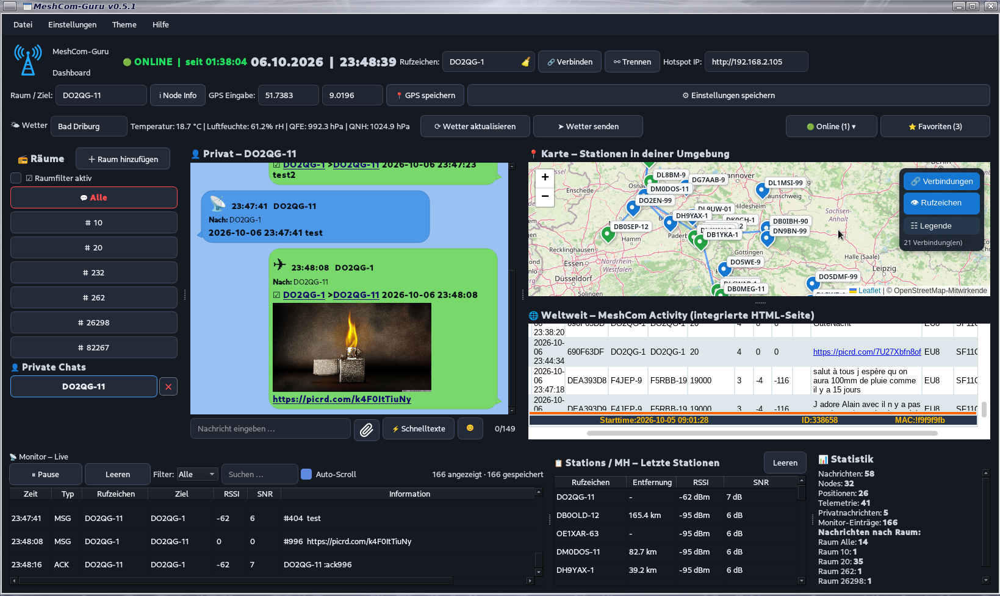
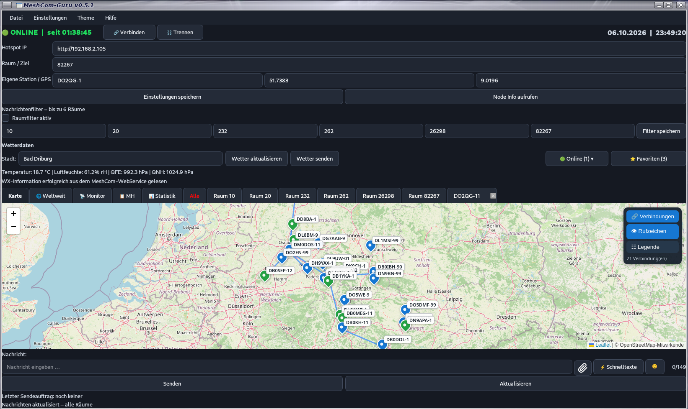
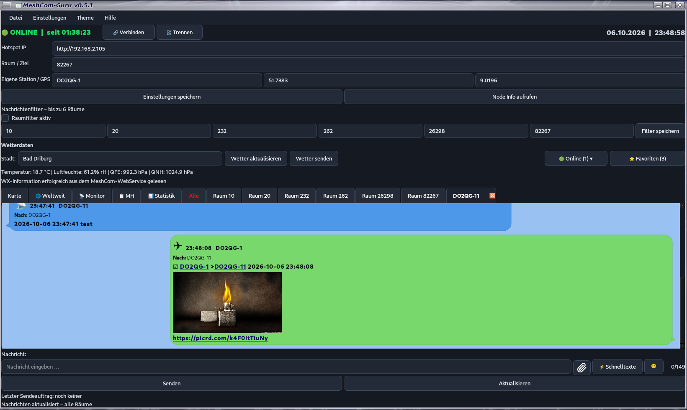

# MeshCom-Guru

**Aktuelle Version: 0.5.3**

MeshCom-Guru ist eine eigenständige Anwendung zur Anzeige von MeshCom-Nachrichten, Node-Informationen und Positionsdaten.








[Github Seite](https://github.com/Angonikro/MeshCom-Guru/)

## Inhalt

- Chat mit empfangenen MeshCom-Nachrichten
- Räume und private Nachrichten
- Node-Informationen
- Kartenanzeige mit Positionsdaten
- **Karten-Verbindungen:** tatsächlich empfangene MeshCom-Pfade können als Linien auf der Karte angezeigt werden.
- **Farbige Kartenmarker:** Marker zeigen den Aktivitätsstatus über Blau/Grün/Orange/Grau; die eigene Station wird Rot dargestellt.
- **Rufzeichen auf der Karte:** Die Callsign-Anzeige kann direkt unter „Verbindungen“ ein- und ausgeschaltet werden.
- **Kompaktes Marker-Infofenster:** Position, Entfernung, letzte Aktivität sowie vorhandener Akkustand, Node-Typ und Firmware.
- Anzeige eigener Positionsdaten
- integriertes Menü **Hilfe**
- integrierte **Anleitung**
- **Info**-Fenster mit Programmversion
- Linux- und Windows-Startdateien
- Desktop-Launcher für Linux
- Nachrichtenfeld mit einer maximalen Länge von **149 Zeichen**
- Live-Zeichenzähler im Nachrichtenfeld (`0/149` bis `149/149`)
- **Emoji-Auswahl** direkt am Nachrichtenfeld mit automatischem Schließen nach der Auswahl
- **Bildvorschau für Picrd-Links:** Erkannte Bildlinks werden direkt im Chat als Vorschau angezeigt; normale Internetlinks bleiben unverändert anklickbar.

### Dokumentation

Im Release sind acht PDF-Handbücher enthalten. Alle acht wurden auf den Stand v0.5.2 aktualisiert und strukturell überarbeitet:

- 🇩🇪 `docs/MeshCom-Guru_Benutzerhandbuch_v0.5.2_DE.pdf`
- 🇬🇧 `docs/MeshCom-Guru_User_Manual_v0.5.2_EN.pdf`
- 🇮🇹 `docs/MeshCom-Guru_Manuale_Utente_v0.5.2_IT.pdf`
- 🇳🇱 `docs/MeshCom-Guru_Gebruikershandleiding_v0.5.2_NL.pdf`
- 🇫🇷 `docs/MeshCom-Guru_Manuel_Utilisateur_v0.5.2_FR.pdf`
- 🇪🇸 `docs/MeshCom-Guru_Manual_de_Usuario_v0.5.2_ES.pdf`
- 🇸🇪 `docs/MeshCom-Guru_Anvandarmanual_v0.5.2_SV.pdf`
- 🇵🇱 `docs/MeshCom-Guru_Podrecznik_Uzytkownika_v0.5.2_PL.pdf`

## Version 0.5.3 – Optimierter 5-Sekunden-Poll

- ⚡ **Früher Unverändert-Check:** Bei einem identischen WebService-Ergebnis wird die Verarbeitung bereits anhand der unveränderten Rohantwort beendet, bevor die einzelnen Nachrichtenblöcke erneut geparst und signiert werden.
- 🧊 **Weniger GUI-Arbeit bei Leerlauf:** Bei unveränderten 5-Sekunden-Abfragen werden bestehende Chatinhalte und Nachrichten nicht erneut verarbeitet.
- 🛡️ **Bestehende Statuslogik erhalten:** ACK/Echo, 120-Sekunden-Statusfenster, Hard-Freeze, Räume, Privat-Chats, Favoriten, Monitor und Karte bleiben unverändert.
- 🧩 **Gezielte Performance-Änderung:** „Alle“ und Monitor wurden in dieser Version bewusst noch nicht auf einen inkrementellen Neuaufbau umgestellt.

## Version 0.5.2 – 5-Sekunden-Refresh und ACK/Echo-Optimierung

- ⚡ **Weniger unnötige Arbeit bei 5-Sekunden-Refreshs:** Der WebService wird weiterhin regelmäßig abgefragt, aber der lokale Nachrichtenbestand wird nicht mehr bei jedem unveränderten Abruf erneut vollständig sortiert.
- 💤 **Unveränderte Chatansichten:** Wenn sich der sichtbare Inhalt nicht geändert hat, werden die vorhandenen Chat-Bubbles nicht erneut aufgebaut. Das reduziert die GUI-Arbeit besonders bei vielen Nachrichten in **Alle** und den Räumen.
- ✓ **Echo/ACK als eigene Statusänderung:** Eine Bestätigung ist keine neue Chatnachricht und wird deshalb separat behandelt. Der Status einer vorhandenen Nachricht kann dadurch auch ohne weitere Nachricht sichtbar auf **✓/✓✓** wechseln.
- 🏠 **Mehrere offene Sendungen:** Echo und ACK werden der passenden offenen Nachricht zugeordnet und nicht nur der zuletzt gesendeten Nachricht. Dadurch funktionieren Bestätigungen auch bei Nachrichten in mehreren Räumen.
- 📡 **Monitor unabhängig:** Die Chat-Bestätigung hängt nicht davon ab, ob im Monitor gerade eine ACK-Zeile sichtbar ist.
- 🛡️ **Bestehende Funktionen erhalten:** 120-Sekunden-Statusfenster, Hard-Freeze, Räume, Privat-Chats, Favoriten/Online-Status, Karte und WebService bleiben erhalten.
- ⭐ **Favoriten mit Namen:** Im Favoriten-Manager kann zu jedem Rufzeichen optional ein Name gespeichert und später geändert werden. Name und Rufzeichen werden auch in der Online-Anzeige und im Online-Popup gemeinsam angezeigt.

## Version 0.5.1 – Favoriten und Online-Status

- ⭐ **Favoriten:** Rufzeichen können direkt aus „Alle“ sowie im Favoriten-Manager zu den Favoriten hinzugefügt und wieder entfernt werden.
- 🟢 **Online-Favoriten:** Ein dauerhaft sichtbarer **🟢 Online**-Button zeigt neu online gekommene Favoriten.
- 🎨 **Statusfarben:** Der Online-Status kann über frei einstellbare Zeitgrenzen für Grün, Gelb und Orange bewertet werden; danach wird der Favorit als 🔴 offline dargestellt.
- 🔔 **Signalton:** Für das erstmalige Online-Kommen eines Favoriten kann der bereits in MeshCom-Guru eingestellte Signalton verwendet oder deaktiviert werden.
- 🪟 **Online-Popup:** Beim neuen Online-Kommen eines Favoriten erscheint ein Popup. Die Anzeigedauer ist von 0 bis 60 Sekunden einstellbar; 0 deaktiviert das Popup.
- 🕒 **Direkte Zeitreferenz:** Beim Hinzufügen eines Rufzeichens aus „Alle“ wird die Zeit der angeklickten Nachricht als letzte Aktivität übernommen. Beim manuellen Hinzufügen wird vorhandene lokale Empfangsaktivität als Referenz verwendet.
- 🌍 **Acht Sprachen:** Die neuen Favoriten-, Online-, Popup- und Statusfunktionen sind in Deutsch, Englisch, Italienisch, Niederländisch, Französisch, Spanisch, Schwedisch und Polnisch dokumentiert.
- 📖 **Dokumentation:** Integrierte Anleitung und alle acht PDF-Handbücher wurden auf v0.5.1 erweitert.

## Version 0.5.0 – 120-Sekunden-Statusfenster und Hard-Freeze

- ⏳ **120-Sekunden-Bestätigungsfenster:** Eine neu gesendete oder empfangene Nachricht darf bis zu 120 Sekunden ihren Status aktualisieren. Dadurch haben auch weiter entfernte Stationen mehr Zeit für Echo und ACK.
- 🔒 **Hard-Freeze nach 120 Sekunden:** Nach Ablauf des Zeitfensters wird die Nachricht vollständig eingefroren. Spätere ACKs, Echos, Refreshs oder Neuaufbauten dürfen ihren Status nicht mehr verändern.
- 🧊 **Kein späterer Status-Neuaufbau:** Bereits eingefrorene Nachrichten werden bei späteren Aktualisierungen nicht erneut in einen offenen Status zurückgesetzt.
- ♾️ **Kein 100-Nachrichten-Limit:** Die bisherige Begrenzung auf 100 Nachrichten bleibt entfernt.
- 🧭 **Navigation erhalten:** Der funktionierende ursprüngliche Chat-Aufbau und die Navigation zwischen „Alle“, Räumen und privaten Chats bleiben erhalten.
- 🛡️ **Stabilitätsprinzip:** Die Änderung beschränkt sich auf das Status-Zeitfenster; die übrigen getesteten Funktionen werden nicht verändert.
- 📖 **Dokumentation:** Die v0.5.0-Funktionsbeschreibung bleibt Bestandteil der aktuellen Dokumentation.

# Sprache / Language

Unter **Einstellungen → Sprache / Language …** kann zwischen **Deutsch, English, Italiano, Nederlands, Français, Español, Svenska und Polski** gewechselt werden. Die Auswahl wird in `~/.MeshCom/settings.ini` gespeichert und beim nächsten Start wieder verwendet.

Die Benutzeroberfläche wird übersetzt; empfangene Nachrichten, Rufzeichen, Raum- und Zielnummern sowie persönliche Inhalte bleiben unverändert. Die integrierte **Hilfe → Anleitung** folgt der gewählten Sprache.

# Chat-Farben

Unter **Einstellungen → Chat-Farben …** können die Chat-Farben angepasst werden. Die Hintergrundfarbe gilt gemeinsam für alle Raum- und Chat-Ansichten. Die Schriftfarbe wird nur für den Tab **Alle** verwendet; die normalen Chat-Bubbles behalten ihre bestehende Farb- und Textdarstellung. Zusätzlich kann die Farbe für **anklickbare Rufzeichen und Internetlinks** unabhängig ausgewählt werden.

Die gewählte Linkfarbe wird gespeichert und in den Chat-Bubbles sowie beim HTML-Chat-Export verwendet. Mit **Standard wiederherstellen** werden die Chat-Farben einschließlich der Linkfarbe auf die Standardwerte zurückgesetzt; die Standard-Linkfarbe ist `#062f6f`.

# Kontextmenü in Eingabefeldern

Ein Rechtsklick in ein Eingabefeld öffnet das Qt-Kontextmenü. Die Standardbefehle wie Rückgängig, Wiederholen, Ausschneiden, Kopieren, Einfügen, Löschen und Alles auswählen werden entsprechend der gewählten Sprache angezeigt.

# Wetterdaten – BME280/BMP280

Unter **Einstellungen → Wetterdaten** kann die Wetteranzeige aktiviert werden. MeshCom-Guru liest die WX-Information direkt aus dem MeshCom-WebService des verbundenen Nodes. Unterstützt werden die dort angezeigten Werte **Temperatur, Luftfeuchte, QFE und QNH**.

Wenn am MeshCom-Node ein **BME280 oder BMP280 Wettermodul** erkannt wird, können die Wetterinformationen genutzt werden. Der eingegebene **Stadtname** wird zusammen mit den aktuellen Wetterwerten über **Wetter senden** ohne Raumangabe übertragen.

Ist die Wetterfunktion aktiviert, wird die WX-Information nach jedem Programmstart automatisch neu geladen. Die Funktion ist weiterhin als **Testfunktion** gedacht.

# OSM-Karte

Die OSM-/Leaflet-Kartenansicht bietet eine vergrößerte Kartenfläche.

# Persönliche Einstellungen

Die persönliche Konfiguration wird benutzerbezogen unter folgendem Pfad gespeichert:

```text
~/.MeshCom/settings.ini
```

Die Programmdateien selbst bleiben unter `/usr/share/MeshCom`. Beim ersten Start werden nur neutrale Standardwerte angelegt; persönliche Rufzeichen, Hotspot-IP und Räume werden nicht fest in den Programmdateien vorgegeben.

# Debian-Paket

Das Debian-Paket installiert MeshCom-Guru direkt unter:

```text
/usr/share/MeshCom
```

Es wird **keine eigene virtuelle Python-Umgebung** angelegt und während der Paketinstallation werden keine Python-Pakete per `pip` installiert. Das Paket bringt einen Menüeintrag und das Programm-Icon mit.

# Nachrichtenlänge

MeshCom-Nachrichten dürfen maximal **149 Zeichen** enthalten. Das Nachrichtenfeld begrenzt die Eingabe automatisch auf 149 Zeichen. Rechts im Eingabefeld zeigt ein Live-Zähler jederzeit die aktuelle Länge an, zum Beispiel `0/149`, `24/149`, `57/149` oder `149/149`.

Damit ist sofort sichtbar, wie viele Zeichen noch zur Verfügung stehen.

## Internetlinks und Bildvorschau im Chat

Internetlinks in empfangenen Nachrichten werden automatisch als anklickbare Links dargestellt. Ein Klick auf einen Link mit `http://` oder `https://` öffnet die Adresse im Standard-Webbrowser des Systems.

**Picrd-Bildlinks** werden zusätzlich geprüft. Wenn das Linkziel ein Bild bereitstellt, zeigt MeshCom-Guru eine kleine Bildvorschau direkt im Chat. Der ursprüngliche Link bleibt unter der Vorschau anklickbar. Links ohne Bildziel werden weiterhin ganz normal dargestellt. Bereits angezeigte Vorschauen werden bei späteren Chat-Aktualisierungen nicht doppelt eingefügt.

## Chat-Export

Über **Datei → Chat exportieren …** kann der aktuell ausgewählte Chat als **HTML, TXT oder CSV** gespeichert werden. Der HTML-Export enthält anklickbare Rufzeichen und Internetlinks und verwendet die aktuell eingestellte Linkfarbe. Der Export greift auf die vorhandenen Chatdaten zu und verändert die laufende Chat-Darstellung nicht.

---

# Installation unter Linux

## 1. ZIP-Datei entpacken

Entpacke die ZIP-Datei so, dass der Projektordner genau

`MeshCom`

heißt.

Beispiel:

```text
~/Downloads/MeshCom
```

## 2. Terminal öffnen

Wechsle in den Projektordner:

```bash
cd ~/Downloads/MeshCom
```

## 3. WebKitGTK für „Weltweit“ installieren

Unter **Linux / Raspberry Pi** benötigt der Tab **🌐 Weltweit** WebKitGTK.

Führe im Projektordner einmal aus:

```bash
chmod +x install_webkitgtk.sh
./install_webkitgtk.sh
```

Das Skript installiert die benötigten WebKitGTK-Systempakete. Dieser Schritt ist unter Linux für die Weltweit-Ansicht erforderlich.

## 4. Abhängigkeiten installieren

Führe aus:

```bash
chmod +x run_linux.sh install_desktop_launcher.sh scripts/create_desktop_entry.sh
```

Danach:

```bash
python3 -m pip install -r requirements.txt
```

Falls dein Linux-System die Installation von Python-Paketen außerhalb einer virtuellen Umgebung verhindert, kannst du eine virtuelle Umgebung verwenden:

```bash
python3 -m venv .venv
source .venv/bin/activate
pip install -r requirements.txt
```

## 5. MeshCom-Guru starten

Mit:

```bash
./run_linux.sh
```

Alternativ:

```bash
python3 main.py
```

---

# Desktop-Launcher unter Linux installieren

MeshCom-Guru enthält ein Skript zum Erstellen einer Desktop-Verknüpfung.

Wechsle zuerst in den Projektordner:

```bash
cd ~/Downloads/MeshCom
```

Dann:

```bash
chmod +x install_desktop_launcher.sh
./install_desktop_launcher.sh
```

Falls das Skript mit fehlenden Rechten abbricht:

```bash
sudo ./install_desktop_launcher.sh
```

Danach sollte ein Starter für **MeshCom-Guru** im Desktop-/Anwendungsmenü vorhanden sein.

Zusätzlich kann der Desktop-Eintrag über das enthaltene Skript erstellt werden:

```bash
chmod +x scripts/create_desktop_entry.sh
./scripts/create_desktop_entry.sh
```

Der Launcher startet MeshCom-Guru über das Projekt und verwendet das mitgelieferte Icon.

---

# Installation unter Windows

## 1. ZIP-Datei entpacken

Entpacke die ZIP-Datei in einen geeigneten Ordner, zum Beispiel:

```text
C:\MeshCom
```

Der eigentliche Projektordner muss **MeshCom** heißen.

## 2. Python installieren

Für Windows wird Python **3.10 bis 3.14** benötigt. Die aktuelle PySide6-Version 6.11.2 unterstützt diese Python-Versionen.

Bei der Python-Installation sollte **Add Python to PATH** aktiviert werden.

## 3. Abhängigkeiten installieren

Öffne die Eingabeaufforderung oder PowerShell und wechsle in den Projektordner:

```bat
cd C:\MeshCom
```

Danach:

```bat
python -m pip install -r requirements.txt
```

Die Kartenfunktion verwendet die integrierte OSM-/Leaflet-Darstellung. Für die Weltweit-Ansicht wird unter Linux/Raspberry Pi WebKitGTK verwendet.

**Hinweis:** `PySide6-WebEngine` wird nicht mehr als eigenes Paket verwendet.

## 4. MeshCom-Guru starten

Die mitgelieferte Windows-Startdatei kann verwendet werden:

```text
run_windows.bat
```

Alternativ:

```bat
python main.py
```

Die mitgelieferte `run_windows.bat` prüft die Python-Version, installiert die benötigten Pakete und startet anschließend MeshCom-Guru.

---

# Hilfe und Info

In der Menüleiste befindet sich der Punkt:

**Hilfe**

Dort stehen zwei Funktionen zur Verfügung:

### Weltweit

Der Tab **🌐 Weltweit** befindet sich direkt neben **Karte** und öffnet die öffentliche MeshCom-Aktivitätsseite des ÖVSV. Beim Laden wird automatisch **ACTIVITY** ausgewählt. Die eingebettete Webseite übernimmt ihre eigene Aktualisierung; MeshCom-Guru führt keinen zusätzlichen 15-Sekunden-Refresh aus.

### Anleitung

Öffnet eine integrierte Kurzanleitung direkt in MeshCom-Guru.

### Info

Öffnet ein kleines Informationsfenster mit:

**MeshCom-Guru**  
**Version 0.5.3**

**By Goldisoft 2026**

---

# Chat

Im Chatbereich werden empfangene MeshCom-Nachrichten angezeigt.

Die vorhandenen Tabs ermöglichen die getrennte Anzeige von:

- allen Nachrichten
- Räumen
- privaten Nachrichten

Nachrichten können über das Eingabefeld erstellt und mit **Senden** übertragen werden.

### Wetter senden

Die Wetterfunktion sendet die aktuelle Wetterinformation jetzt in den Raum, in dem man sich aktuell befindet.

### Raumfilter

Der Raumfilter filtert die Nachrichten jetzt korrekt nach den gespeicherten Räumen.

### Kartenentfernung

Bei anderen Stationen wird im Kartenmarker zusätzlich die Entfernung zur eigenen Station angezeigt, sofern eigene GPS-Koordinaten vorhanden sind.

---

# Node-Informationen

Empfangene Node-Informationen können angezeigt werden.

Je nach übertragenen Daten können unter anderem folgende Informationen vorhanden sein:

- Rufzeichen
- Firmware
- Hardware-ID
- RSSI
- SNR
- Batterie
- Temperatur
- weitere Telemetriedaten
- Positionsdaten

---

# Karte und Koordinaten

Wenn ein Node Positionsdaten überträgt, können diese auf der Karte als Marker dargestellt werden.

Dabei werden insbesondere folgende Daten verwendet:

- Breitengrad
- Längengrad
- Höhe
- Rufzeichen

Die Positionsdaten stammen aus den empfangenen MeshCom-Daten.

### Kartenmarker-Infofenster

Beim Anklicken eines Markers zeigt das Infofenster Position, Entfernung und letzte Aktivität. Wenn Telemetriedaten vorhanden sind, werden zusätzlich Akkustand, Node-Typ, Firmware und **Temperatur** angezeigt. Das geöffnete Infofenster bleibt bei normalen Kartenaktualisierungen geöffnet und wird ohne kompletten Neuaufbau aktualisiert.

---

# Eigene Position

Falls die Funktion verwendet wird, können die eigenen Koordinaten über die dafür vorgesehenen Eingabefelder angegeben werden.

Beispiel:

```text
Breitengrad: 51.93
Längengrad: 8.88
```

---

# Eigenständiger Betrieb

MeshCom-Guru ist als eigenständige Anwendung aufgebaut.

Die Anwendung benötigt **keine Zusammenarbeit mit MeshDash**.

---

# Projektdateien

Wichtige Dateien und Verzeichnisse:

```text
MeshCom/
├── core/
├── data/
├── docs/
├── icons/
├── scripts/
├── ui/
├── main.py
├── requirements.txt
├── run_linux.sh
├── run_windows.bat
├── install_desktop_launcher.sh
├── README.md
├── CHANGELOG.md
└── VERSION
```

---

# Start unter Linux – Kurzfassung

```bash
cd ~/Downloads/MeshCom
chmod +x run_linux.sh
./run_linux.sh
```

Desktop-Launcher:

```bash
cd ~/Downloads/MeshCom
chmod +x install_desktop_launcher.sh
./install_desktop_launcher.sh
```

---

# Start unter Windows – Kurzfassung

Im Ordner `MeshCom` einfach

```text
run_windows.bat
```

starten.

---

**MeshCom-Guru v0.5.3**  
**By Goldisoft 2026**


## GitHub

Dieses Paket ist als vollständiger Projektstand für GitHub vorbereitet.
Der ZIP-Inhalt beginnt mit dem Ordner `MeshCom/`.

Die Projektdateien, Dokumentation, Startdateien, Desktop-Launcher,
Anleitung und das Programm-Icon sind im Projekt enthalten.

Die integrierte Anleitung in **Hilfe → Anleitung** ist die aktuelle, mehrsprachige Anleitung. Die mitgelieferten PDF-Handbücher bleiben bewusst auf dem v0.5.2-Dokumentationsstand, da v0.5.3 keine neue Bedienfunktion oder geänderte Benutzeroberfläche einführt.


## Hilfe und Info

In der Menüleiste gibt es **Hilfe → Anleitung** mit einer integrierten Kurzanleitung sowie **Hilfe → Info** mit Programmname, Version und Urheberhinweis.

73 de DO2QG Andreas
